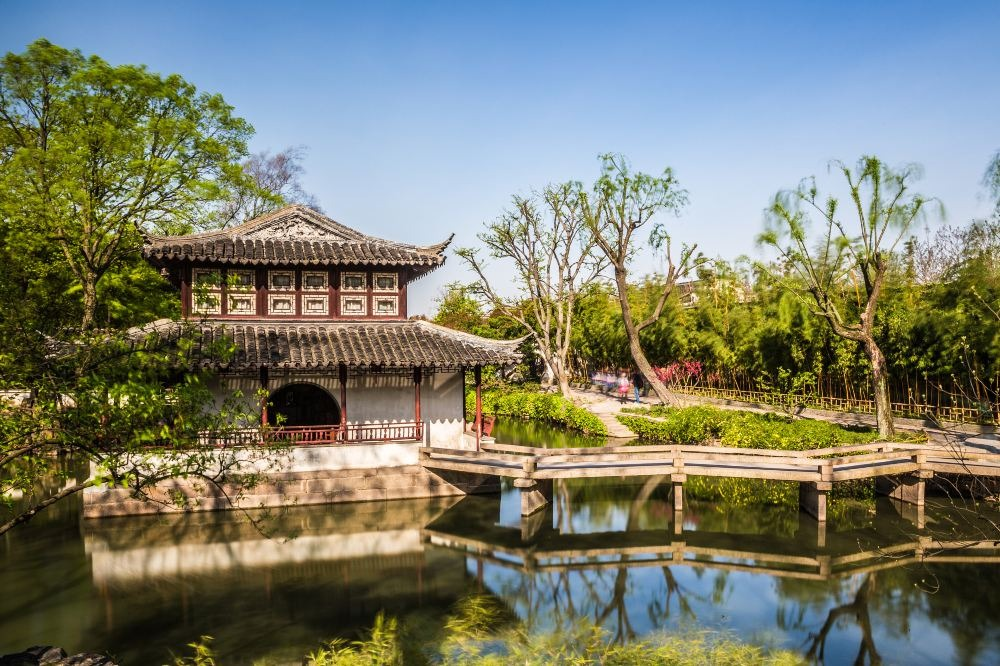

# 拙政园：一园一世界  
> “疏影横斜水清浅，暗香浮动月黄昏。”

---

## 🏛️ 简史  
- **起源**：拙政园原为明代正德年间御史王献臣归隐之所，取意《闲居赋》中“拙者之为政”而得名。园内以水为中心，厅堂环绕，曲桥相映，是江南园林典型的“水景写意”格局。  
- **演变**：明末数度易主，至清代分为东、中、西三园，各具风韵。民国后多为官宦寓所，1950年代由政府接管并修复。  
- **现状**：现为世界文化遗产，苏州古典园林中面积最大、保存最完整者之一。游客络绎，但晨昏之间仍可窥见其本来静气。

---

## 👣 我看到的  
初冬的清晨，雾未散尽。  
我从北门入园，游人寥寥，唯有池水映着残荷与灰瓦。  
曲廊回折，步步生景；园深处传来淡淡琴声——似有人在“远香堂”调弦。  
我站在小桥上，看水光与窗影交织，一瞬恍若穿越数百年，  
那时的士人也许正凭栏读书，想天下事，叹世事如流水。  

---

## 💭 思考  
拙政园并非“逃避现实”的桃源，而是一种自省的空间。  
“拙”并不是笨拙，而是一种对世道的反思——  
当“巧”成了权谋，“拙”便是清醒。  
在苏州，园林不仅是建筑，更是一种精神态度：  
以有限之地，造无限之境。  

---

## 📚 参考资料  
- 《拙政园志》  
- 苏州园林管理处官方资料  
- 联合国教科文组织世界遗产中心文档  
- 个人实地笔记（2024年12月）
